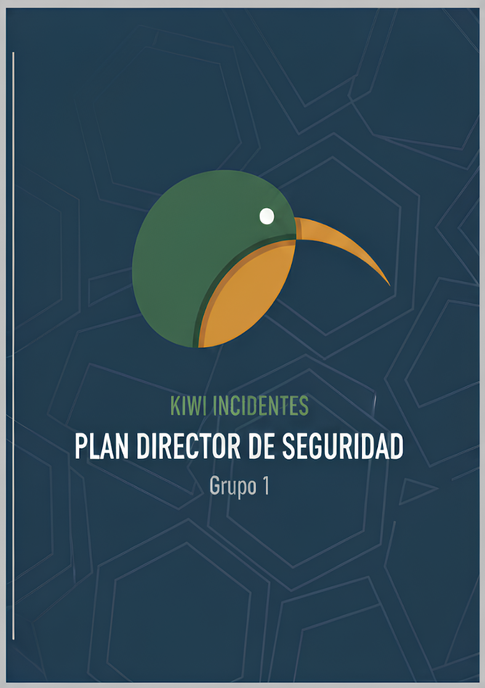

# IS-1.a.03-G1

- [IS-1.a.03-G1](#is-1a03-g1)
- [1. Introducción](#1-introducción)
  - [1.1 Importancia de la seguridad de la información](#11-importancia-de-la-seguridad-de-la-información)
  - [1.2 Plan Director de Seguridad (PDS)](#12-plan-director-de-seguridad-pds)
- [2. Situación Actual de la Empresa](#2-situación-actual-de-la-empresa)
  - [2.1 Contexto de la empresa y estrategia de negocio](#21-contexto-de-la-empresa-y-estrategia-de-negocio)
  - [2.2 Acotar y establecer un alcance](#22-acotar-y-establecer-un-alcance)
  - [2.3 Identificación de los responsables de la gestión de los activos](#23-identificación-de-los-responsables-de-la-gestión-de-los-activos)
  - [2.4 Análisis de riesgos](#24-análisis-de-riesgos)
    - [Introducción al análisis](#introducción-al-análisis)
    - [2.4.1 Alcance del análisis](#241-alcance-del-análisis)
    - [2.4.2 Análisis de los activos](#242-análisis-de-los-activos)
    - [2.4.3 Análisis de las amenazas](#243-análisis-de-las-amenazas)
    - [2.4.4 Establecimiento de las vulnerabilidades](#244-establecimiento-de-las-vulnerabilidades)
    - [2.4.5 Evaluación y cálculo de riesgo](#245-evaluación-y-cálculo-de-riesgo)
  - [2.5 Objetivos basados en los activos críticos](#25-objetivos-basados-en-los-activos-críticos)
    - [2.5.1. Estrategia de tratamiento del riesgo:](#251-estrategia-de-tratamiento-del-riesgo)
    - [2.5.2. Iniciativas y controles a implantar:](#252-iniciativas-y-controles-a-implantar)
- [3. Estrategia de la Empresa](#3-estrategia-de-la-empresa)
- [4. Definición de Proyectos e Iniciativas.](#4-definición-de-proyectos-e-iniciativas)
  - [Línea Estratégica 1: Gobierno y políticas de seguridad](#línea-estratégica-1-gobierno-y-políticas-de-seguridad)
    - [Proyecto 1.1: Políticas de seguridad de la información](#proyecto-11-políticas-de-seguridad-de-la-información)
  - [Línea Estratégica 2: Protección de activos y continuidad](#línea-estratégica-2-protección-de-activos-y-continuidad)
    - [Proyecto 2.1: Copias de seguridad](#proyecto-21-copias-de-seguridad)
    - [Proyecto 2.2: Plan de respuesta y recuperación](#proyecto-22-plan-de-respuesta-y-recuperación)
    - [Proyecto 2.3: Monitorización SIEM](#proyecto-23-monitorización-siem)
    - [Proyecto 2.4: Gestión de contraseñas y MFA](#proyecto-24-gestión-de-contraseñas-y-mfa)
  - [Línea Estratégica 3: Cumplimiento y relaciones externas](#línea-estratégica-3-cumplimiento-y-relaciones-externas)
    - [Proyecto 3.1: Control y seguimiento de proveedores externos](#proyecto-31-control-y-seguimiento-de-proveedores-externos)
  - [Línea Estratégica 4: Personas y cultura de seguridad](#línea-estratégica-4-personas-y-cultura-de-seguridad)
    - [Proyecto 4.1: Formación y concienciación de empleados](#proyecto-41-formación-y-concienciación-de-empleados)
  - [Línea Estratégica 5: Control de acceso y segmentación](#línea-estratégica-5-control-de-acceso-y-segmentación)
    - [Proyecto 5.1: Implementación del principio de privilegio mínimo](#proyecto-51-implementación-del-principio-de-privilegio-mínimo)
    - [Proyecto 5.2: Segmentación de redes y cifrado de datos](#proyecto-52-segmentación-de-redes-y-cifrado-de-datos)
  - [Línea Estratégica 6: Seguridad en aplicaciones y servicios web](#línea-estratégica-6-seguridad-en-aplicaciones-y-servicios-web)
    - [Proyecto 6.1: Seguridad web y pentesting](#proyecto-61-seguridad-web-y-pentesting)
- [5. Clasificación y Priorización de los Proyectos](#5-clasificación-y-priorización-de-los-proyectos)
  - [Fase 1: Quick Wins críticos.](#fase-1-quick-wins-críticos)
  - [Fase 2: Consolidación de controles clave.](#fase-2-consolidación-de-controles-clave)
  - [Fase 3: Optimización y mejora continua.](#fase-3-optimización-y-mejora-continua)
- [6. Aprobación del PDS](#6-aprobación-del-pds)
- [7. Puesta en marcha del PDS](#7-puesta-en-marcha-del-pds)
- [8. Tareas Asociadas y Responsables](#8-tareas-asociadas-y-responsables)
- [9. Conclusiones](#9-conclusiones)
    - [Principales desafíos](#principales-desafíos)
    - [Hoja de ruta definida](#hoja-de-ruta-definida)
    - [Factores críticos de éxito](#factores-críticos-de-éxito)
- [Anexos](#anexos)
    - [**1. Definición de proyectos e Iniciativas**](#1-definición-de-proyectos-e-iniciativas)

# 1. Introducción

## 1.1 Importancia de la seguridad de la información

**Contexto general:**

La seguridad de la información no es solo “parar virus”. Es un sistema de medidas técnicas y organizativas que guía el comportamiento de empleados y dirección para proteger datos sensibles y sostener la continuidad del negocio. 

En nuestro caso, la compañía gestiona datos personales de clientes y proveedores, utiliza web/tienda online, correo, almacenamiento en la nube y redes internas; cualquier alteración de confidencialidad, integridad o disponibilidad impacta ventas, reputación y cumplimiento legal. Por eso, además de controles técnicos, necesitamos políticas, procesos, formación y un gobierno claro de la seguridad.

**Amenazas actuales del entorno digital:**

**Ransomware:** 

Errores humanos, filtraciones, DDoS y fallos de terceros son escenarios realistas para PYMEs con alto peso digital y dos sedes; la dependencia del canal online aumenta el impacto potencial de cualquier incidente. 

**Impacto de incidentes en el negocio:**

Paradas del canal online o cifrado de datos pueden traducirse en pérdida de ingresos, daño reputacional y sanciones RGPD; dirección necesita visibilidad de riesgo y métricas para decidir inversiones.

**Necesidad de enfoque estratégico y planificado:**

Pasar de seguridad reactiva a estratégica: priorizar activos y riesgos, definir responsables y plazos, y medir resultados con KPIs.

**Referencias normativas aplicables:**

RGPD (datos personales), buenas prácticas ISO 27001/27002 y gobierno de controles; se aplicarán “sin sobredimensionar”, adaptadas a la realidad de la empresa.

**Motivación para este PDS:**

Alinear la seguridad con la estrategia digital, reducir el riesgo real del negocio y demostrar cumplimiento y fiabilidad ante clientes/auditores mediante una hoja de ruta medible a 24 meses.

## 1.2 Plan Director de Seguridad (PDS)

**Definición:**

El PDS es un instrumento estratégico aprobado por Dirección que fija principios, políticas y actuaciones para gestionar riesgos y proteger activos en el corto/medio/largo plazo; prioriza recursos, establece controles y nombra responsables de seguimiento e implantación, abarcando medidas técnicas, organizativas y legales. 

**Objetivos del documento:**

1. Conectar seguridad con objetivos de negocio y definir alcance. 
2. Basar decisiones en análisis de riesgos y madurez de controles. 
3. Priorizar proyectos con responsables, plazos y KPIs de seguimiento.

**Alcance temporal:**

Roadmap inicial de 24 meses con revisiones semestrales por Comité de Seguridad.

**Metodología utilizada:**

Enfoque risk-based con referencias ISO 27001/27002 e integración de cumplimiento RGPD; evaluación de la situación actual, riesgos prioritarios y madurez de controles para definir la hoja de ruta.

**Relación con otros documentos:**

Política de seguridad, análisis de riesgos, declaración de aplicabilidad, plan de tratamiento, procedimiento de incidentes, continuidad y control de terceros, además de KPIs y revisiones por Dirección.

# 2. Situación Actual de la Empresa

## 2.1 Contexto de la empresa y estrategia de negocio

**Información general:**

| Aspecto | Descripción |
| --- | --- |
| Sector | Asesoría a autónomos y pymes. |
| Actividad | Servicios de asesoría con fuerte apoyo en web/tienda online, CRM/ERP y correo corporativo. |
| Tamaño | 150 empleados. |
| Sedes | 2 sedes (principal + secundaria). |

**Estructura organizativa:**

Consejo de Administración
│
├── Dirección General
          │
          ├── Facturación y Ventas
          ├── Compras
          ├── Comunicación y RRSS
          ├── TIC
          ├── RRHH
          ├── Delivery
          ├── Mantenimiento
          ├── Legal
          └── Responsable de Seguridad (transversal)

**Infraestructura/activos clave:**

Puestos de trabajo, portátiles/móviles/tabletas, servidores de correo y aplicaciones, red corporativa con wifi y routers, almacenamiento externo, servicios cloud, web/tienda online externalizadas.

**Estrategia de negocio y transformación digital:**

Plan de expansión digital apoyado en la web como canal primario de captación y prestación de servicios; uso de RRSS para visibilidad.

**Factores críticos de éxito:**

1. Continuidad y rendimiento del canal online. 
2. Protección de datos personales y confianza del cliente. 
3. Fiabilidad operativa entre sedes y terceros.

> Nota de madurez actual: controles básicos existentes pero sin marco formal (p.ej. copias, antivirus subcontratado, RGPD con consultoría, firewall/segmentación); falta política de seguridad y control sobre la securización de la web externa. Esto evidencia necesidad de gobernanza y PDS.
> 

## 2.2 Acotar y establecer un alcance

**Principio:** foco en lo crítico y medible, alineado con estrategia digital y recursos disponibles.

**Alcance incluido:**

| Elemento | Incluido | Justificación |
| --- | --- | --- |
| Departamento TIC | Sí | Administra sistemas, red, copias y parches: riesgo transversal. |
| Departamento RRHH | Sí | Trata datos personales (RGPD). |
| Facturación y Ventas | Sí | Datos de clientes y continuidad de ingresos. |
| Web/Tienda online (proveedor) | Sí | Canal crítico de negocio, dependencia externa. |
| Seguridad física (terceros) | Sí (coordinación) | Impacta disponibilidad y cumplimiento; gestión con proveedores. |

**Procesos críticos en alcance:**

- Gestión del canal online: disponibilidad, integridad de transacciones, protección de datos.
- Gestión de identidades y accesos internos: altas/bajas, privilegios mínimos.
- Copias de seguridad y recuperación: RPO/RTO para correo, ficheros y aplicaciones.

**Exclusiones:**

Activos no críticos o sin impacto directo en continuidad/cumplimiento; se revisarán en fases posteriores si el riesgo lo exige.

**Justificación del alcance:**

Prioriza activos con mayor exposición/valor y formaliza coordinación con terceros; maximiza reducción de riesgo con el presupuesto disponible. 

## 2.3 Identificación de los responsables de la gestión de los activos

**Estructura de gobierno de seguridad:**

Dirección General (Sponsor)
│
├── Responsable de Seguridad (CISO)
│
├── Comité de Seguridad
│   ├── Responsable TIC
│   ├── Responsable RRHH
│   ├── Responsable Legal
│   └── Jefes de Departamento
│
└── Administradores de Sistemas

**Responsables por tipo de activo:**

| Tipo de Activo | Propietario | Custodio | Usuario |
| --- | --- | --- | --- |
| Servidores / correo / apps | Director TIC | Admin. de Sistemas | Personal autorizado |
| Datos RRHH | Director RRHH | Admin. de Sistemas | Dpto. RRHH |
| Datos de clientes | Dir. Comercial | Admin. de Sistemas | Ventas/Delivery |
| Web/Tienda (externa) | Dirección | Proveedor (SLA) / Resp. Seguridad (control) | Clientes/Comercial |
| Red y wifi | Director TIC | Admin. Redes | Empleados |

## 2.4 Análisis de riesgos

### Introducción al análisis

El análisis de riesgo se ha realizado siguiendo la metodología ISO/IEC 27001 e ISO/IEC 27002, normas internacionales de referencia para la gestión de la seguridad de la información. Estas normas proporcionan un marco sistemático para identificar, analizar y gestionar lo riesgos que afectan a los activos de información, permitiendo establecer un Sistema de Gestión de Seguridad de la Información alineado con los requisitos regulatorios y las mejores prácticas internacionales.

### 2.4.1 Alcance del análisis

Esta empresa ha desarrollado una estrategia comercial de transformación digital apoyándose en la página web para realizar la mayoría de los trabajos a través de internet, por lo que dependen del funcionamiento de la misma para todas sus actividades comerciales ya que es a través de la tienda online desde donde los clientes contactan con la empresa para solicitar trabajos.

En este documento nos hemos centrado en las áreas de la empresa más críticas para el funcionamiento de la misma y las zonas más vulnerables donde se concentran la mayor cantidad de activos de la empresa para asegurarnos de que las mayores amenazas de la empresa puedan ser evitadas.

### 2.4.2 Análisis de los activos

**Resumen de activos identificados:**

Tal y como nos define el Instituto Nacional de Ciberseguridad, un activo es “cualquier recurso de la empresa necesario para desempeñar las actividades diarias y cuya no disponibilidad o deterioro supone un agravio o coste” . Por lo tanto, una vez realizado el alcance, proseguiremos con la identificación de los activos que forman parte del objeto del PDS. Para realizar un análisis acorde a la demanda que se nos requiere, debemos centrarnos en aquellos activos que guardan una relación directa con el objeto de estudio.

- Datos personales de clientes y proveedores
- Servidores de correo electrónico, almacenamiento y aplicaciones
- Equipos de trabajo: PCs, portátiles, móviles, impresoras
- Sistemas de almacenamiento externo: discos duros, pendrives
- Infraestructura de red: routers, cortafuegos, Wi-Fi segmentado
- Página web y tienda online alojadas en proveedor externo
- Servicios en la nube para almacenamiento

| Categoría | Cantidad | Criticidad Alta | Criticidad Media | Criticidad Baja |
| --- | --- | --- | --- | --- |
| Hardware | 150+ | 5 | 145 | 0 |
| Software | 12 | 4 | 6 | 2 |
| Datos | 8 | 5 | 2 | 1 |
| Servicios | 6 | 4 | 2 | 0 |
| Personal | 150 | 10 | 140 | 0 |
| Total | 326+ | 28 | 295 | 3 |

### 2.4.3 Análisis de las amenazas

A partir del inventario de activos y del análisis de riesgos se han identificado diferentes tipos de amenazas que pueden afectar a la empresa. La siguiente tabla resume la cantidad de amenazas consideradas y su probabilidad estimada de materialización por categoría:

| Tipo de Amenaza | Cantidad | Probabilidad Alta | Probabilidad Media | Probabilidad Baja |
| --- | --- | --- | --- | --- |
| Desastres naturales | 2 | 0 | 1 | 1 |
| De origen industrial | 3 | 0 | 1 | 2 |
| Errores y fallos no intencionados | 5 | 2 | 2 | 1 |
| Ataques intencionados | 6 | 3 | 2 | 1 |
| **Total** | **16** | **5** | **6** | **5** |

Principales amenazas identificadas:

**Amenaza 1: Ransomware en servidores y puestos de trabajo**

- **Tipo:** Ataques intencionados
- **Probabilidad:** Alta
- **Activos afectados:** Servidores de ficheros, PCs de oficina, portátiles, copias de seguridad, datos de clientes y documentación interna.
- **Descripción:** Posible infección por malware tipo ransomware que cifre la información crítica e impacte en la continuidad del negocio, especialmente si las copias de seguridad no están correctamente protegidas o verificadas.

---

**Amenaza 2: Phishing y robo de credenciales**

- **Tipo:** Ataques intencionados
- **Probabilidad:** Alta
- **Activos afectados:** Cuentas de correo corporativas, accesos a aplicaciones en la nube, panel de administración de la web/tienda online.
- **Descripción:** Campañas de phishing dirigidas a empleados que pueden provocar robo de credenciales y accesos no autorizados a sistemas internos o servicios externos críticos.

---

**Amenaza 3: Caída prolongada del proveedor de hosting / servicios cloud**

- **Tipo:** De origen industrial
- **Probabilidad:** Media
- **Activos afectados:** Página web corporativa, tienda online, servicios de correo y almacenamiento en la nube.
- **Descripción:** Interrupción del servicio por incidencias técnicas o fallos del proveedor que dejen la web o servicios externos inaccesibles durante un tiempo prolongado, afectando a ventas, imagen y relación con clientes.

---

**Amenaza 4: Borrado o modificación accidental de información**

- **Tipo:** Errores y fallos no intencionados
- **Probabilidad:** Alta
- **Activos afectados:** Bases de datos, documentos compartidos, registros de clientes y proveedores, ficheros de trabajo.
- **Descripción:** Errores humanos (borrado de archivos, sobrescrituras, cambios no controlados) debidos a falta de procedimientos, permisos excesivos o ausencia de formación, que pueden comprometer la integridad de la información.

---

**Amenaza 5: Incendio o daño físico en las instalaciones principales**

- **Tipo:** Desastres naturales / origen físico
- **Probabilidad:** Baja
- **Activos afectados:** CPD local, equipos de red, servidores, puestos de trabajo, documentación en papel.
- **Descripción:** Incendio, inundación u otro evento físico que afecte a las oficinas y al equipamiento, con impacto directo en la disponibilidad de los sistemas y en la continuidad de las operaciones si no existen medidas de redundancia y recuperación adecuadas.

### 2.4.4 Establecimiento de las vulnerabilidades

En este apartado se identifican las medidas de seguridad así como las vulnerabilidades identificadas que pueden afectar a los activos. El objetivo es conocer el nivel de protección actual y detectar las áreas donde hay que mejorar la seguridad.

La empresa cuenta con unas medidas básica de protección, tanto técnicas como organizativas:

*a) Medidas técnicas:*

- **Antivirus corporativo**: Gestionado por empresa externa.
- **Cortafuegos**: Separa la red interna de la pública. Existe segmentación de red por departamentos.
- **Copias de seguridad**: Realizadas por el personal TIC y almacenadas en la sede. Existe un procedimiento en caso de incidente.
- **Servidores de correo y aplicaciones internos**: Gestionados en las instalaciones de la empresa.
- **Uso de servicios en la nube**: Para almacenamiento y parte de la operativa del negocio.
- **Cumplimiento de las normativas**: Mediante consultoría especializada.

*b) Medidas organizativas:*

- **Responsable de seguridad:** Coordina acciones con las empresas externas de seguridad.
- **Seguridad física**: Cubierta por empresas externas.
- **Procedimientos básicos documentados**: Copias de seguridad y mantenimiento de antivirus.

Estas medidas son un comienzo adecuado pero insuficientes para una empresa que está ampliando su actividad digital y depende de Internet y la Nube.

**Vulnerabilidades**

Se identifican varias vulnerabilidades que podrían comprometer la seguridad de la información y servicios de la empresa:

*a) Vulnerabilidades técnicas:*

- **Ausencia de políticas de seguridad formalizadas**: No existen documentos para establecer normas claras del uso de los activos.
- **Mala gestión de actualizaciones:** No se menciona control centralizado de parches por lo que puede dejar equipos expuestos.
- **Copias de seguridad almacenadas en la misma sede**: En caso de incidente físico, podrían perderse todos los datos.
- **Externalización de servicios:** La empresa no tiene control ni información sobre el estado de seguridad de la página web y la tienda online.
- **Falta de monitorización y control de intrusiones**: No se mencionan auditorías periódicas de seguridad ni ningún sistema de monitoreo.
- **Uso de móviles y almacenamiento externo**: Existe riesgo de sustracción de información si no se aplican medidas de control de acceso a los activos.

*b) Vulnerabilidades organizativas y humanas:*

- **Poca cultura de seguridad:** No existen políticas ni formación al respecto.
- **Dependencia de subcontratas**: Tanto en seguridad física como en gestión TIC.
- **Documentación no aprobada por la dirección:** Al carecer de validación formal, reduce su fuerza y seguimiento.
- **Acceso de personal externo a las sedes**: proveedores, clientes o técnicos subcontratados podrían acceder a zonas sensibles o equipos.

**Análisis de madurez de controles (ISO 27002:2022):**

| **Dominio de control** | **Total controles** | **Implementación** | **Parciales** | **No implementados** | **%** 
**Madurez** | **Nivel** |
| --- | --- | --- | --- | --- | --- | --- |
| Organizativos | 37 | 12 | 15 | 10 | 32,4% | REPETIBLE |
| Personas | 8 | 2 | 3 | 3 | 25,0% | INICIAL |
| Físicos | 14 | 4 | 7 | 3 | 28,6% | INICIAL |
|  Tecnológicos | 34 | 8 | 14 | 12 | 23,5% | INICIAL |
| Total | 93 | 26 | 39 | 28 | 28% | REPETIBLE |

Nivel de Madurez

| **Nivel de Madurez** | **Porcentaje** | **Descripción** | **Características Principales** |
| --- | --- | --- | --- |
| INICIAL | 0-20% | Sin procesos definidos. Controles inexistentes o muy básicos. Alto riesgo y falta de gobernanza. | Caótico, sin planificación |
| REPETIBLE | 21-40% | Procesos básicos documentados pero aplicación inconsciente. Algunos controles implementados pero no formalizados. | Básico |
| DEFINIDO | 41-60% | Procesos bien definidos y documentados. La mayoría de controles están implementados. Mejora continua iniciada. | Documentado y comunicado |
| GESTIONADO | 61-80% | Procesos maduros, monitoreados y medibles. La mayoría de controles funcionan correctamente con indicadores KPI definidos. | Medible y controlado |
| OPTIMIZADO | 81-100% | Excelencia en seguridad. Procesos optimizados, automatizados y con mejora continua permanente. Cultura de seguridad sólida. | Automatizado y optimizado |

**Salvaguardas Existentes - Estado Actual**

| **Control** | **Estado Actual** | **Nivel Madurez** | **Efectividad** | **Impacto en Riesgo** | **Prioridad Mejora** |
| --- | --- | --- | --- | --- | --- |
| Copias de seguridad | Parcial (manual, en sede) | Inicial | Media (25%) | Mitiga disponibilidad (medio) | Alta |
| Antivirus | Básico | Inicial | Media (30%) | Mitiga malware (medio | Media |
| Firewall | Básico | Inicial | Media (40%) | Mitiga acceso no autorizado (medio) | Media |
| Cumplimiento de RGPD | Implementado | Definido | Alta (90%) | Cumple normativa (alto) | Mantenimiento |
| Políticas de seguridad | No formalizadas | Inicial | Baja (15%) | Bajo (sin aplicación) | Crítica |
| MFA (Autenticación multifactor) | No Implementado | Inicial | Nula (0%) | Crítico - No existe | Crítica |
| Encriptación en tránsito (HTTPS) | Parcial | Inicial | Baja (20%) | Bajo (parcial) | Crítica |
| Encriptación en reposo (AES-256) | No implementado | Inicial | Nula (0%) | Crítico - No existe | Crítica |
| Gestión de parches y actualizaciones | Manual, inconsistente | Inicial | Baja (25%) | Medio (vulnerabilidades presentes) | Alta |
| SIEM y monitoreo centralizado | No implementado | Inicial | Nula (0%) | Crítico - Sin visibilidad | Crítica |
| Control de acceso físico | Manual, deficiente | Inicial | Baja (20%) | Crítico - Acceso físico vulnerable | Alta |
| Segmentación de red | Parcial (por departamentos) | Inicial | Media (35%) | Medio (movimiento lateral posible) | Media |
| Plan de respuesta a incidentes | No documentado | Inicial | Nula (0%) | Crítico - Sin respuesta | Crítica |
| Gestor de contraseñas centralizado | No implementado | Inicial | Nula (0%) | Crítico - Riesgo de credenciales | Crítica |
| VPN y acceso remoto seguro | No implementado | Inicial | Nula (0%) | Crítico - Acceso remoto inseguro | Alta |
| DLP (Data Loss Prevention) | No implementado | Inicial | Nula (0%) | Crítico - Sin prevención de fugas | Alta |
| Formación en seguridad | Mínima/esporádica | Inicial | Baja (20%) | Bajo (conciencia limitada) | Media |
| Auditorías de seguridad externas | No realizado | Inicial | Nula (0%) | Sin auditoría externa | Media |

### 2.4.5 Evaluación y cálculo de riesgo

Una vez identificadas las vulnerabilidades y las medidas de seguridad, procedemos a evaluar el riesgo

que están expuestos los activos de la empresa.

**Los activos más relevantes para la empresa, por su valor y su papel en las operaciones diarias, son:**

- Datos personales de clientes y proveedores
- Servidores de correo electrónico, aplicaciones y almacenamiento
- Página web y tienda online
- Equipos de trabajo (PCs, portátiles, móviles)
- Sistemas de copia de seguridad y almacenamiento externo
- Redes internas y conexión a Internet

| **Activo** | **Amenaza** | **Probabilidad (P)** | **Impacto (I)** | **Riesgo (R = P×I)** | **Nivel de riesgo** |
| --- | --- | --- | --- | --- | --- |
| Datos personales | Fuga o pérdida de datos (error humano o malware) | 2 | 3 | 6 | **Alto** |
| Servidores | Fallo técnico o ataque ransomware | 2 | 3 | 6 | **Alto** |
| Web y Tienda online | Ataques web | 3 | 3 | 9 | **Alto** |
| Equipos de trabajo | Infección por malware o robo físico | 2 | 2 | 4 | **Medio** |
| Copias de seguridad | Pérdida por fallo o incendio en sede | 1 | 2 | 2 | **Bajo** |
| Red corporativa / Wi-Fi | Acceso no autorizado o intrusión | 2 | 3 | 6 | **Alto** |
| Dispositivos móviles | Pérdida o robo | 2 | 2 | 4 | **Medio** |
| Dependencia de proveedores externos | Fallos de seguridad o indisponibilidad del servicio | 2 | 3 | 6 | **Alto** |

## 2.5 Objetivos basados en los activos críticos

Para desarrollar un marco robusto que proteja de manera integral tanto la información como los sistemas que respaldan su actividad, se establece el siguiente conjunto de objetivos, después de realizar un análisis exhaustivo de riesgos centrado en los activos más importantes para esta empresa.

Con estos objetivos, se pretende garantizar la confianza de los proveedores y clientes, así como la continuidad de las operaciones frente a los riesgos actuales y futuros. Además están en consonancia con la estrategia comercial.

El propósito es que la información que maneja la empresa y sistemas estén asegurados y fiables para reducir lo máximo posible los ataques, incidentes o pérdidas que puedan afectar a la empresa y su reputación.

Basándonos en el análisis de riesgo realizado y en los activos más importantes de la empresa, se plantean las siguientes medidas para reforzar la protección y mejorar la seguridad general.

### 2.5.1. Estrategia de tratamiento del riesgo:

La empresa llevará a cabo una estrategia con el objetivo de reducir o dificultar lo máximo posible  los riesgos mediante controles técnicos.

Los relacionados con servicios externos se trasladarán parcialmente a los proveedores, a través de contratos que incluyan cláusulas de seguridad y compromisos de revisión.

Respecto a los casos donde el riesgo sea bajo o el coste de reducción sea demasiado alto, el riesgo se aceptará de forma controlada y se documentará para tener un seguimiento sobre ese riesgo.

Tras aplicar la estrategia, el riesgo residual se considera que está bajo control y es compatible con las operaciones normales de la empresa, manteniendo la actividad continua de la empresa.

### 2.5.2. Iniciativas y controles a implantar:

- **Copias de seguridad automáticas y cifradas:** tanto en local como en la nube con inspecciones periódicas para asegurar que esté todo correctamente.
- **Creación de una política de seguridad de la información:** aprobada por la dirección, que se establezca una normas claras para tener el control de la información sensible de la empresa, el uso de contraseñas, respuesta ante incidentes, etc.
- **Controlar las actualizaciones:** gestionar las actualizaciones de todos los equipos, servidores y dispositivos con las últimas versiones y parches de seguridad para evitar riesgos.
- **Supervisión de los proveedores externos:** vigilar activamente a los encargados de la web corporativa y servicios en la nube, garantizando auditorías y revisiones de seguridad.
- **Cursos de formación:** formar continuamente a los trabajadores de la empresa para prevención frente a los ataques de la ingeniería social.
- **Revisión periódica de los permisos:** aplicando el principio de mínimo privilegio para proteger accesos internos.
- **Cifrado de información sensible:** cifrar la información de los clientes y de la empresa para evitar filtraciones y segmentación de redes para separar zonas críticas de la infraestructura.
- **Plan de acción ante incidentes:** hacer simulacros y crear un plan donde se definan los responsables, procedimientos y tiempo de recuperación en caso de emergencia.
- **Riesgo residual y seguimiento: Una vez aplicadas las medidas, el nivel de riesgo se reducirá de forma considerable, quedando en los márgenes aceptados y definidos por la empresa. Se seguirá teniendo una revisión constante para evitar amenazas o cambios tecnológicos.**

La implementación final de estos objetivos se realiza dentro de un proceso de mejora continua, con la participación activa de todos los departamentos y el compromiso decidido de la dirección.

Se definirán indicadores claves de desempeño que posibiliten evaluar la efectividad de las acciones puestas en marcha, asegurando que el plan se desarrolle de manera dinámica para adaptarse a los cambios en el ambiente regulatorio y tecnológico, y también a las alteraciones en la estructura organizativa.

Esta visión integral y proactiva fortalecerá la capacidad de la empresa para mitigar riesgos, proteger activos críticos y preservar su reputación a largo plazo, asegurando así la capacidad de resistir a las amenazas operativas y cibernéticas.

Mapa de relación Objetivos-Activos-Riesgos:

| **Objetivo** | **Activos Críticos** | **Riesgos Principales** | KPI | **Prioridad** | **Plazo** |
| --- | --- | --- | --- | --- | --- |
| **Proteger Datos de Clientes y Proveedores** | Datos personales | Fuga o pérdida de datos | 15 % —> 60 % | Alta | 0-12 meses |
| **Garantizar Continuidad del Negocio** | Web y Tienda online,
 Puestos de trabajo | Fallo técnico, Ataques web,
Infección por malware | 70 % —> 99 % | Alta | 12-24 meses |
| **Cumplir Normativa RGPD** | .Datos personales, Puestos de trabajo, Servidores | Sanciones Económicas | 25 % —> 90 % | Alta | 12-24 meses |
| **Establecer Cultura de Seguridad** | Datos personales, 
Puestos de Trabajo,
Datos personales | Fuga o pérdida de datos, Infección por malware | 10 % —> 80 % | Alta | 0-12 meses |

# 3. Estrategia de la Empresa

El objetivo de la empresa es buscar extender su presencia y servicios principalmente a través de la digitalización, apoyándose en su página web y tienda online.

Esta orientación exige tener una buena seguridad que permita sostener la reputación de la empresa hacía los clientes y garantizar la continuidad del negocio en el entorno digital.

La estrategia de seguridad debe enfocarse en los activos digitales y la información sensible, integrando políticas y controles que respondan a los riesgos asociados a esta digitalización avanzada, incluidos los riesgos externos derivados de proveedores y servicios en la nube.

Modelo de madurez objetivo:

| **Dominio** | **Estado Actual** | **Estado Objetivo** | **Gap** |
| --- | --- | --- | --- |
| Gobierno y Políticas | Inicial | Definido | 2 |
| Hardening tecnológico y copias | Repetible | Gestionado | 2 |
| Personas y formación | Inicial | Gestionado | 2 |
| Terceros y contratos de seguridad | Inicial | Optimizado | 4 |
| Respuesta a incidentes y monitorización | Inicial | Gestionado | 3 |

# 4. Definición de Proyectos e Iniciativas.

Para alcanzar los objetivos estratégicos de seguridad, proponemos los siguientes proyectos e iniciativas basados en la información recopilada, siguiendo la sugerencia que propone INCIBE:

- Iniciativas para mejorar el cumplimiento normativo y los métodos de trabajo.
- Iniciativas técnicas y físicas para la rectificación de deficiencias.
- Iniciativas orientadas al tratamiento de riesgos relevantes.

Cada una de las iniciativas deberá desarrollarse teniendo en cuenta los siguientes elementos: objetivo, responsables, recursos, dependencias, alcance, coste, duración y dependencias.

## Línea Estratégica 1: Gobierno y políticas de seguridad

### Proyecto 1.1: Políticas de seguridad de la información

**Código:** PRY-001

**Objetivos estratégicos:** Definir el marco normativo y los compromisos de la dirección.

**Alcance:** Toda la organización y subcontratas.

**Justificación:** Fundamental para orientar la estrategia de seguridad y conseguir la implicación de la dirección.

**Beneficios esperados:** Reducción de incidentes, base para el resto de proyectos.

**Recursos necesarios:**

- **Personas:** Responsable de Seguridad.
- **Presupuesto estimado:** 3.000€
- **Tecnología:** Herramienta gestión documental.
- **Externos:** Consultoría regulatoria.

**Duración:** 2 meses

**Dependencias:** Aprobación de la dirección.

**Riesgos:** Falta de compromiso, resistencia al cambio.

**Indicadores de éxito:**

- Políticas aprobadas (100%).
- Empleados informados (90%).

## Línea Estratégica 2: Protección de activos y continuidad

### Proyecto 2.1: Copias de seguridad

**Código:** PRY-002

**Objetivos estratégicos:** Garantizar la integridad y disponibilidad de la información.

**Alcance:** Servidores locales, almacenamiento en la nube y endpoints críticos. 

**Justificación:** Prevenir pérdida de información por fallos, desastres o ataques.

**Beneficios esperados:** Recuperación ante incidentes, cumplimiento de auditorías.

**Recursos necesarios:**

- **Personas:** Departamento TIC.
- **Presupuesto estimado:** 2.000€
- **Tecnología:** Software backup compatible con sistemas existentes.
- **Externos:** No necesario.

**Duración:** 1 mes

**Dependencias:** Inventario de activos.

**Riesgos:** Fallos de backup y falta de pruebas.

**Indicadores de éxito:** 

- Recuperación exitosa en simulación (95%).

### Proyecto 2.2: Plan de respuesta y recuperación

**Código:** PRY-007

**Objetivos estratégicos:** Establecer procedimientos ante incidentes y su recuperación

**Alcance:** Toda la organización, web y proveedores.

**Justificación**: Fundamental para resiliencia y cumplimiento normativo.

**Beneficios esperados:** Planes claros y simulaciones validadas.

**Recursos necesarios:**

- **Personas:** Responsable Seguridad.
- **Presupuesto estimado:** 2.000€
- **Tecnología:** Herramienta gestión de planes.
- **Externos:** Consultoría metodológica.

**Duración:** 2 meses

**Dependencias:** Copias de seguridad implementadas.

**Riesgos:** Falta de colaboración, simulacros insuficientes.

**Indicadores de éxito:**

- Incidentes gestionados en menos de 24h (80%).

### Proyecto 2.3: Monitorización SIEM

**Código:** PRY-009

**Objetivos estratégicos:** Mejorar la seguridad de acceso a sistemas críticos mediante políticas de contraseñas robustas y MFA.

**Alcance:** Equipos, servidores, servicios cloud y correo corporativo.

**Justificación:** Un SIEM facilita la visibilidad y el análisis frente a accesos sospechosos y amenazas internas/externas, ayudando a responder de forma ágil a incidentes.

**Beneficios esperados:** Accesos controlados y monitorizados, priorización en respuesta ante anomalías.

**Recursos necesarios:**

- **Personas:** Departamento TIC y Responsable de Seguridad.
- **Presupuesto estimado:** 1800€
- **Tecnología:** Gestor de contraseñas, plataforma SIEM y licencias MFA
- **Externos:** Formación puntual sobre el sistema.

**Duración estimada:** 1 mes

**Dependencias:** Políticas de seguridad aprobadas.

**Riesgos del proyecto:** Falta de integración con sistemas antiguos, errores de configuración.

**Indicadores de éxito:**

- Alertas automáticas generadas (100%).
- Incidentes detectados antes de causar impacto (90%).

### Proyecto 2.4: Gestión de contraseñas y MFA

**Código:** PRY-010

**Objetivos estratégicos:** Detectar incidentes y accesos no autorizados mediante el análisis centralizado de logs.

**Alcance:** Infraestructura de red, servidores y endpoints corporativos.

**Justificación:** La correcta gestión reduce los accesos ilícitos y mejora la trazabilidad para auditorías y respuesta ante incidentes.

**Beneficios esperados:** Incidentes detectados y gestionados rápidamente, cumplimiento de auditorías y normativas.

**Recursos necesarios:**

- **Personas:** Responsable Seguridad.
- **Presupuesto estimado:** 4000€
- **Tecnología:** Plataforma SIEM, y protocolo de registro del sistema centralizado.
- **Externos:** Consultorías sobre MFA y formación interna.

**Duración estimada:** 3 meses

**Dependencias:** Inventario de activos y roles definido.

**Riesgos del proyecto:** Resistencia a cambios en autenticación, fallos en integración MFA.

**Indicadores de éxito:**

- Introducción obligatoria de MFA (100%).
- Reducción de accesos no autorizados (95%).

## Línea Estratégica 3: Cumplimiento y relaciones externas

### Proyecto 3.1: Control y seguimiento de proveedores externos

**Código:** PRY-003

**Objetivos estratégicos:** Asegurar el cumplimiento de requisitos de seguridad.

**Alcance:** Hosting web, correo, seguridad física, consultorías, y almacenamiento en nube.

**Justificación:** Prevención de vulnerabilidades introducidas por terceros.

**Beneficios esperados:** Contratos y auditorías actualizadas, proveedores alineados.

**Recursos necesarios:**

- **Personas:** Responsable de Seguridad.
- **Presupuesto estimado:** 1.500€
- **Tecnología:** Herramienta gestión de contratos.
- **Externos:** Auditorías a terceros.

**Duración:** 2 meses

**Dependencias:** Contratos actualizados.

**Riesgos:** Falta de control sobre proveedores, incumplimientos legales.

**Indicadores de éxito:**

- Proveedores auditados (100%).
- Contratos revisados (95%).

## Línea Estratégica 4: Personas y cultura de seguridad

### Proyecto 4.1: Formación y concienciación de empleados

**Código:** PRY-004

**Objetivos estratégicos:** Sensibilizar y capacitar al personal en buenas prácticas.

**Alcance:** Toda la plantilla y proveedores internos relevantes.

**Justificación**: Es clave para minimizar riesgos internos.

**Beneficios esperados:** Empleados formados, disminución de incidentes por error humano.

**Recursos necesarios:**

- **Personas:** Responsable de Seguridad y RRHH.
- **Presupuesto estimado:** 2.000€
- **Tecnología:** Plataforma e-learning.
- **Externos:** Consultoría en contenidos.

**Duración:** 3 meses

**Dependencias:** Disponibilidad de empleados

**Riesgos:** Falta de interés y baja asistencia.

**Indicadores de éxito:**

- Participación cursos (80%)
- Reducción de incidentes (30%).

## Línea Estratégica 5: Control de acceso y segmentación

### Proyecto 5.1: Implementación del principio de privilegio mínimo

**Código:** PRY-005

**Objetivos estratégicos:** Limitar el acceso de usuarios exclusivamente a los recursos necesarios.

**Alcance:** Sistemas, servidores, cuentas privilegiadas y accesos remotos.

**Justificación:** Reducción de superficies de ataque interno.

**Beneficios esperados:** Menos accesos indebidos, auditorías exitosas.

**Recursos necesarios:**

- **Personas:** Responsable de Seguridad y TIC.
- **Presupuesto estimado:** 1.200€
- **Tecnología:** Herramientas gestión accesos.
- **Externos:** Sin necesidad.

**Duración:** 2 meses

**Dependencias:** Inventario de roles y accesos.

**Riesgos:** Errores en asignación, dificultad de gestión.

**Indicadores de éxito:**

- Accesos no autorizados detectados (0%).

### Proyecto 5.2: Segmentación de redes y cifrado de datos

**Código:** PRY-006

**Objetivos estratégicos:** Proteger la información mediante la separación de redes y cifrado de datos.

**Alcance:** VLANs por departamentos, red WiFi, web, servidores y backups.

**Justificación:** Multiplica barreras de protección y dificulta ataques.

**Beneficios esperados:** Mejora de seguridad y cumplimiento normativo.

**Recursos necesarios:**

- **Personas:** Departamento de TIC.
- **Presupuesto estimado:** 2.500€
- **Tecnología:** Firewall y software cifrado.
- **Externos:** Proveedores de soluciones.

**Duración:** 2 meses

**Dependencias:** Inventario de activos críticos.

**Riesgos:** Fallos configuración, impacto en rendimiento.

**Indicadores de éxito:**

- Segmentación completa (95%).
- Datos cifrados (100%).

## Línea Estratégica 6: Seguridad en aplicaciones y servicios web

### Proyecto 6.1: Seguridad web y pentesting

**Código:** PRY-008

**Objetivos estratégicos:** Evaluar y reforzar la seguridad de la página web y tienda online frente a vulnerabilidades técnicas

**Alcance:** Web corporativa, APIs, y servidores web.

**Justificación:** El aumento de amenazas web y ataques dirigidos hacen esencial disponer de auditorías técnicas y refuerzo de la seguridad, evitando incidentes que puedan comprometer los datos o la reputación.

**Beneficios esperados:** Web robusta, reducción vulnerabilidades.

**Recursos necesarios:**

- **Personas:** Responsable de Seguridad.
- **Presupuesto estimado:** 3.000€
- **Tecnología:** OWASP ZAP, Burp Suite, y servidores monitorizados.
- **Externos:** Consultoría externa, proveedor hosting.

**Duración:** 2 meses

**Dependencias:** Contrato con proveedor web actualizado.

**Riesgos:** Descubrimiento de vulnerabilidades graves, impacto reputacional.

**Indicadores de éxito:**

- Vulnerabilidades críticas corregidas (100%).
- Disponibilidad del servicio (99.9%).

La tabla con estas iniciativas se encuentra en el Anexo 1.

# 5. Clasificación y Priorización de los Proyectos

La priorización se basa en la criticidad de los activos afectados y la reducción del riesgo que aportan los proyectos:

| **Proyecto** | **Esfuerzo** | **Prioridad** | **Justificación** | **Responsable** |
| --- | --- | --- | --- | --- |
| Formación y aprobación de políticas de seguridad | Medio | Alta | Establece marco para gobernanza y cumplimiento | Responsable de Seguridad |
| Implantación de copias y alta  seguridad automáticas y cifradas | Medio | Alta | Garantizar recuperación ante pérdida o ciberataque | Departamento TIC |
| Centralización automatización de actualizaciones y parches | Medio | Alta | Reduce vulnerabilidades y errores de configuración | Departamento TIC |
| Programa de formación y concienciación continua | Medio | Media | Minimiza riesgos por error humano e ingeniería social | RRHH y Seguridad |
| Control y auditoría de proveedores externos | Alto | Media | Asegura integridad y disponibilidad en servicios críticos externos | Responsable de Seguridad |
| Implementación del principio de mínimo privilegios | medio | Media | Limitar accesos innecesarios para reducir superficie de ataque | Responsable de Seguridad |
| Segmentación de redes y cifrado de datos | alto | Baja | Añade capa adicional de seguridad a la infraestructura | Departamento TIC |
| Desarrollo de plan de respuesta a incidentes | medio | Alta | Garantiza capacidad ante incidentes graves | Responsable de Seguridad |

A partir de esta priorización estableceremos lo que serán el roadmap, a través del cual estableceremos el orden de prioridad según el nivel de riesgo que hemos determinado.

## Fase 1: Quick Wins críticos.

En los primeros 6 meses nos centramos en los quick wins, ya que nos proporcionarán  unos resultados visibles  en un corto periodo de tiempo con acciones rápidas.

- Backups cifrados y automatizados.
- Políticas mínimas de seguridad aprobadas.
- Control de parches centralizado.
- Revisión de la seguridad de la web y servicios cloud.
- Definir el plan de respuesta a incidentes.

## Fase 2: Consolidación de controles clave.

En esta fase, que se realizará entre los 6 y 12 meses, nos centraremos en la consolidación y profundización.

- Revisamos y reforzamos los contratos con terceros.
- Implementamos una monitorización continua con herramientas SIEM.
- Lanzamiento de programas anti-phishing.
- Aplicación del principio de mínimo privilegio.

## Fase 3: Optimización y mejora continua.

En esta fase final, nos enfocaremos en la optimización de las medidas ya realizadas. Esto se traducirá en la segmentación avanzada de redes y el cifrado de los datos sensibles; la realización de auditorías internas de manera regular; la utilización de métricas y KPIs (*Key Performance Indicator)* que se consolidarán a través del Comité de Seguridad; y ajustarnos según las nuevas amenazas que vayan surgiendo.

# 6. Aprobación del PDS

El Plan Director de Seguridad (PDS) que se ha desarrollado para la empresa debe ser presentado y aprobado formalmente por la **Dirección General**. Esta aprobación no es solo un trámite, sino la forma de asegurar:

- El **compromiso institucional** con la seguridad de la información.
- La **asignación de recursos** para ejecutar los proyectos definidos.
- El **respaldo visible** para que todas las áreas adopten las medidas de seguridad como parte de su trabajo diario.

Este apoyo explícito de la dirección es clave para que el PDS se difunda en todos los niveles de la organización y para impulsar una **cultura de seguridad compartida.**

Una vez aprobado, es importante establecer mecanismos de seguimiento y control que permitan evaluar el desarrollo e implantación de las iniciativas planteadas, facilitando ajustes necesarios y asegurando la efectividad continua del plan en la protección de los activos críticos de la empresa.

Con ello, se garantiza que el PDS no se quede en un documento teórico, sino que sea una herramienta real para proteger a la empresa.

# 7. Puesta en marcha del PDS

La estrategia definida en este PDS tiene un plazo **inicial de dos años**, con:

- **Revisiones formales cada seis meses**, donde se revisará el grado de ejecución de los proyectos, la evolución de los riesgos y el nivel de madurez de los controles.
- Ajustes puntuales siempre que haya **cambios relevantes.**

De este modo, se asegura que el PDS responda de forma **realista y actualizada** a las necesidades de la empresa, apoyando su **estrategia de transformación digital** y contribuyendo a:

- Mantener la **continuidad del negocio**.
- Proteger la **confidencialidad, integridad y disponibilidad** de la información.
- Reforzar la **confianza de clientes y proveedores** en sus servicios digitales.

Para la puesta en marcha se elaborará un **cronograma detallado**, donde se reflejen:

- Los proyectos e iniciativas definidos en el PDS.
- Los **responsables** de cada proyecto.
- Los **recursos necesarios** (internos y externos).
- Los **plazos de inicio y fin**, así como hitos intermedios cuando proceda.

Este cronograma permitirá organizar el trabajo en fases (corto, medio y largo plazo), priorizando primero las iniciativas que reducen los riesgos más críticos y afectan a los activos más sensibles.

Además, se realizará un **seguimiento continuo y riguroso** de la eficacia de las medidas implantadas:

- Reuniones periódicas de seguimiento (por ejemplo, un **comité de seguridad** interno).
- Informes de avance donde se comparen los resultados reales con el cronograma.
- Revisión de indicadores (incidentes, tiempos de respuesta, grado de cumplimiento de políticas, etc.).
- Propuestas de mejora para corregir desviaciones o incorporar nuevas necesidades.

Así se garantiza que el PDS se mantenga **actualizado, alineado con la realidad de la empresa y en mejora continua**, siguiendo un enfoque similar a un ciclo **PDCA** (Plan–Do–Check–Act).

# 8. Tareas Asociadas y Responsables

| **Tarea** | **Responsable** |
| --- | --- |
| Elaboración y difusión de las políticas de seguridad | Responsable de Seguridad |
| Implementación de copias d seguridad automáticas | Departamento TIC |
| Gestión centralizada de actualizaciones y parches | Departamento TIC |
| Formación y concienciación | RRHH y Responsable de Seguridad |
| Control y auditoría de proveedores externos | Responsable de Seguridad |
| Revisión y ajuste de acceso y permisos | Responsable de Seguridad |
| Implementación de segmentación y cifrado | Departamento TIC |
| Desarrollo y simulación del plan de respuesta | Responsable de Seguridad |

# 9. Conclusiones

La empresa parte de una seguridad de la información básica y poco formalizada: cuenta con algunos controles técnicos (copias de seguridad, antivirus, firewall, consultoría RGPD), pero carece de políticas por escrito, roles claros y procedimientos formales para accesos, incidentes o proveedores. 

Al mismo tiempo, está en plena transformación digital, depende cada vez más de la web, la tienda online y servicios en la nube para tratar información sensible, lo que aumenta su exposición a ciberamenazas con un nivel de madurez aún bajo. 

Esta combinación de alta dependencia de sistemas críticos y falta de cultura y planificación en seguridad sitúa a la organización en un escenario donde un incidente grave podría impactar directamente en la continuidad del negocio, la reputación y el cumplimiento normativo.

### Principales desafíos

- **Desafío 1: Formalizar la seguridad.**
- Desafío 2: Reducir riesgos técnicos críticos.
- Desafío 3: Personas y capacidad de respuesta.

### Hoja de ruta definida

El PDS define una **estrategia por fases** que combina medidas organizativas, técnicas y de formación, priorizadas según la criticidad de los activos y el nivel de riesgo. Primero se establece la base de **gobernanza**: creación y aprobación de políticas de seguridad, definición de roles, gestión de proveedores y formalización de procesos clave.

En paralelo, se abordan los **proyectos técnicos prioritarios. Estos proyectos atacan directamente los riesgos más altos identificados en el análisis.**

Por último, se complementa con un **programa continuo de formación y concienciación** y con un **plan de respuesta a incidentes** probado mediante simulacros.

**Beneficios esperados**

| Área | Beneficio | Indicador | Meta |
| --- | --- | --- | --- |
| Riesgo | Reducción de riesgos críticos | Nivel de riesgo | -50% |
| Cumplimiento | Conformidad normativa | % cumplimiento ISO 27001 | 90% |
| Operacional | Menor tiempo de recuperación | RTO medio | -40% |
| Económico | Reducción costes de incidentes | Coste anual incidentes | -60% |
| Reputacional | Mejora confianza de los clientes | NPS seguridad | +30 puntos |

### Factores críticos de éxito

- **Compromiso de la dirección:** apoyo explícito, aprobación del PDS y ejemplo hacia el resto de la organización.
- **Asignación de recursos adecuados:** presupuesto, tiempo y personas para ejecutar los proyectos definidos.
- **Gestión del cambio efectiva:** acompañar a las personas en la adopción de nuevas políticas, procesos y herramientas.
- **Comunicación clara y continua:** explicar el por qué de las medidas, los beneficios y el impacto en el día a día.
- **Seguimiento y adaptación constante:** medir, revisar y ajustar el plan según evolucionen el negocio, la tecnología y las amenazas.

Este Plan Director de Seguridad no pretende convertir a la empresa en “perfecta” de un día para otro, sino marcar una **hoja de ruta realista** para pasar de un modelo básico a un modelo **planificado, preventivo y alineado con el negocio**. 

La seguridad deja de ser un coste inevitable para convertirse en una **inversión estratégica** que protege el futuro digital de la empresa.

# Anexos

### **1. Definición de proyectos e Iniciativas**

| **Código** | **Proyecto** | **Objetivo** | **Alcance** | **Responsable** | **Recursos** | **Duración** | **Coste** | **Dependencias** |
| --- | --- | --- | --- | --- | --- | --- | --- | --- |
| PRY-001 | Políticas de seguridad de la información | Definir el marco normativo y los compromisos de la dirección | A toda la empresa | Responsable de Seguridad | Consultoría externa | 2 meses | 3.000€ | Aprobación de la dirección |
| PRY-002 | Copias de seguridad | Garantizar la integridad y disponibilidad de la información | Sistemas críticos | Responsable de IT | Software  de backup | 1 mes | 2.000€ | Inventario de activos |
| PRY-003 | Control y seguimiento de proveedores externo | Asegurar el cumplimiento de requisitos de seguridad | Proveedores externos | Responsable de ámbito | Herramientas de gestión | 2 meses | 1.500€ | Contratos actualizados |
| PRY-004 | Formación y concienciación de empleados | Sensibilizar y capacitar al personal en buenas prácticas | Todo el personal | Responsable de Seguridad | Plataforma e-learning | 3 meses | 2.000€ | Disponibilidad de empleados |
| PRY-005 | Implementación del principio de privilegio mínimo | Limitar el acceso de usuarios exclusivamente a los recursos necesarios | Sistemas y usuarios | Responsable de ámbito | Herramientas de gestión de accesos | 2 meses | 1.200€ | Inventario de roles y accesos |
| PRY-006 | Segmentación de redes y cifrado de datos | Proteger la información mediante la separación de redes y cifrado de datos | Datos sensibles y redes | Responsable de Seguridad | Firewall, software de cifrado | 2 meses | 2.500€ | Inventario de activos críticos |
| PRY-007 | Plan de respuesta y recuperación | Establecer procedimientos ante incidentes y su recuperación | Toda la empresa | Responsable de Seguridad | Equipo técnico, consultoría externa | 2 meses | 2.000€ | Copias de seguridad implementadas |
| PRY-008 | Seguridad web y pentesting | Evaluar y reforzar la seguridad de la página web y tienda online frente a vulnerabilidades técnicas | Sitio web corporativo y tienda online externalizada | Responsable de Seguridad / Proveedor externo | Herramientas de análisis (OWASP ZAP, Burp Suite), consultoría externa | 2 meses | 3000€ | Contrato con proveedor web actualizado |
| PRY-009 | Monitorización SIEM | Mejorar la seguridad de acceso a sistemas críticos mediante políticas de contraseñas robustas y MFA | Equipos, servidores, servicios cloud y correo corporativo | Departamento TIC | Gestor de contraseñas, licencias MFA | 1 mes | 1800€ | Políticas de seguridad aprobadas |
| PRY-010 | Gestión de contraseñas y MFA | Detectar incidentes y accesos no autorizados mediante el análisis centralizado de logs | Infraestructura de red, servidores y endpoints | Responsable de Seguridad / TIC | Plataforma SIEM o syslog centralizado, formación básica | 3 meses | 4000€ | Inventario de activos y roles definido |